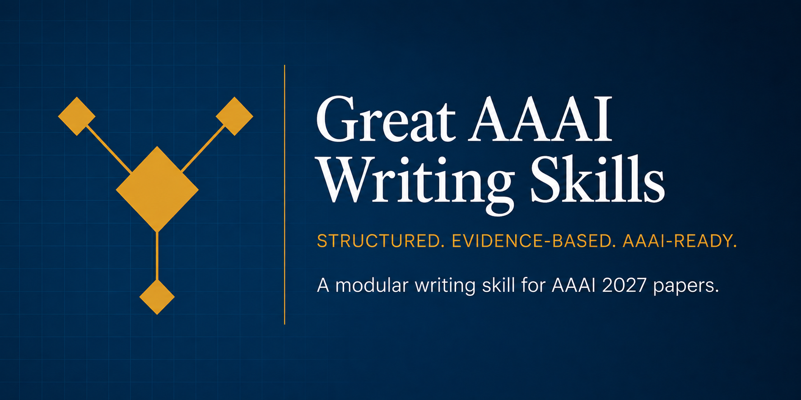

<div align="center">
  
</div>

<div align="center">

[](LICENSE)
[](https://claude.ai/code)
[](https://github.com/openai/codex)
[](https://aaai.org/conference/aaai/aaai-27/)
[](CONTRIBUTING.md)

**中文** · [English](README_zh.md)

</div>

---

## 这是什么？

一个 **Claude Code / Codex CLI skill**，帮你写出更好的 AAAI 2027 论文。它不是一键生成器——而是在每个阶段给你结构化、有据可查的写作指导。每条规律标注来源：`📄`（来自 AAAI 2023–2026 获奖论文）或 `📋`（来自 AAAI 2027 Author Kit 规范）。

---

## 🚀 快速开始

```bash
# Claude Code
git clone https://github.com/HansonLegacy/Great-AAAI-Writing-Skills.git ~/.claude/skills/aaai-writing

# Codex CLI (OpenAI)
git clone https://github.com/HansonLegacy/Great-AAAI-Writing-Skills.git ~/.codex/skills/aaai-writing

# Windows
git clone https://github.com/HansonLegacy/Great-AAAI-Writing-Skills.git %USERPROFILE%\.claude\skills\aaai-writing
```

> 💡 同时支持 **Claude Code** 和 **Codex CLI**——共用同一套 `SKILL.md` 格式。在你提到写 AAAI 论文时自动激活。

> ⚡ **前提条件**：安装 [Claude Code](https://claude.ai/code) 或 [Codex CLI](https://github.com/openai/codex)。

---

## 📖 你能做什么

### 📝 逐章获取初稿反馈

> *"我写了一版 Method 部分，帮我看看哪里可以改进。"*
> *"Introduction 读起来不太顺，问题在哪？"*

把你写好的任何章节草稿丢进去。Skill 会加载对应模块（`sections/method.md`、`sections/introduction.md` 等），基于 50 篇获奖 AAAI 论文提炼出的规律，给出**逐句的修改建议**——不是泛泛的写作 tips。

| 章节 | 检查什么 |
|------|---------|
| 标题 | 可搜索吗？编码了论文类型吗？有 3–10 字符的易记缩写吗？ |
| 摘要 | 遵循五步弧线吗？140–180 词吗？有无禁止的 `\cite`？ |
| 引言 | 符合六段骨架吗？痛点有量化吗？贡献与创新一一对应吗？ |
| 方法 | 有清晰的 overview 图吗？设计选择有动机解释吗？符号一致吗？ |
| 实验 | 每个 claim 都有对应实验吗？消融完整吗？基线全面吗？ |
| 相关工作 | 是主题式（而非作者列表式）的吗？结尾有明确的 gap 陈述吗？ |
| 结论 | ≤ 0.5 页吗？有诚实的局限性讨论吗？future work 具体吗？ |

### 🔍 让 AI 扮演审稿人

> *"把我的论文当成 AAAI PC 成员来审一遍。"*

内置的**审稿模拟器**从 **7 个维度**（significance、novelty、soundness、clarity、experiments、related work、reproducibility）给你的论文打分，评分基于真实 AAAI 录取阈值校准。输出结构化审稿报告——审稿人问题、弱点标注、rebuttal 策略建议。

你还能获得 **65+ 个审稿人触发词**（含正则模式），reviewer 看到就会皱眉的词：`"novel"`、`"first to"`、`"significantly outperforms"`、`"extensive experiments demonstrate"` 等。提交前 grep 一键扫描。

### 📋 检查 .tex 格式合规

> *"我的 paper.tex 是否符合 AAAI 2027 Author Kit？"*

**格式合规模块**扫描 **25+ 个禁用包**（`geometry`、`titlesec`、`ulem`、`fullpage`、`hyperref`……）和 **20+ 个禁用命令**（`\newpage`、`\clearpage`、`\tiny`、`\resizebox`、`\vspace{-`……）。同时检查：US Letter 纸张大小、摘要内引用、页码、章节顺序、图片格式、双盲违规。

支持 **macOS、Linux、Windows**——bash 和 PowerShell 命令都有。

### ✍️ 打磨句子

> *"摘要太啰嗦了，帮我压缩。"*
> *"审稿人说贡献写的太夸张了，怎么改？"*

**34 个填空式句法模板** + **15 组 Before/After 改写**，按章节和功能组织：

- 开场句 → 5 种模式
- 痛点句 → 3 种模式
- 贡献陈述 → 4 种模式
- 结果报告 → 3 种模式
- 局限性声明 → 3 种模式
- 过渡句 → 4 种模式

每个模板告诉你填什么、避什么、适合哪种论文类型。

### 📐 写好图注和表注

> *"这个 caption 符合 AAAI 习惯吗？自包含吗？"*

**7 种 caption 模板** + **8 组 Before/After 改写**。图注（pipeline 图、对比图、teaser 图）和表注（主结果表、消融表、分析表、资源表）分开处理。核心原则：审稿人不看正文就能看懂你的图表。

### 🏷️ 获取论文类型专属策略

> *"我做的是 benchmark 论文，Introduction 该怎么组织？"*

Skill 识别你的论文属于 **4 种类别**之一，全流程注入类型专属指导：

| 类型 | AAAI 获奖论文示例 | 特殊处理 |
|------|-----------------|---------|
| **理论/算法型** | Revelations (2025)、Every-Bit-Helps (2025) | 证明草图结构、Preliminaries + Main Results 替代 Method |
| **模型/方法型** | LLM2CLIP (2026)、CowClip (2023) | 模块逐一描述、SOTA 表、完整消融 |
| **基准/资源型** | DivShift (2025)、DISCount (2024) | 数据采集透明 + 标注者一致性 + 基线多样性 |
| **应用驱动型** | PlantTraitNet (2026)、Slum Detection (2026) | 领域问题 → AI 方案、真实部署、伦理声明 |

---

## ⚡ 五阶段工作流

| # | 阶段 | 做什么 | 产出 |
|---|------|--------|------|
| 1 | 🧭 **定位** | 确定论文类型 + 核心贡献 | 类型（1-4）+ 3 个答案 |
| 2 | 🗺️ **大纲** | 章节规划 + 页数预算 + 图表计划 | 结构化大纲 |
| 3 | ✍️ **逐节撰写** | 按顺序写 7 节（按需加载指导） | LaTeX 初稿 |
| 4 | ✨ **打磨** | Reverse outlining + claim-evidence 映射 + 术语扫描 | 连贯终稿 |
| 5 | 🔍 **终审** | 格式合规 + 双盲 + 可复现性 | 投稿就绪 PDF |

每个阶段只加载需要的模块——不膨胀上下文。

---

## 🏗️ 项目结构

```
Great-AAAI-Writing-Skills/
│
├── SKILL.md                  编排层——五阶段调度器
│
├── sections/                 逐章写作指导
│   ├── title.md              ├── abstract.md         ├── introduction.md
│   ├── related-work.md       ├── method.md           ├── experiments.md
│   └── conclusion.md
│
├── modules/                  横向工艺模块
│   ├── sentence-craft.md     34 个句法模板 + Before/After 改写
│   ├── caption-writing.md    7 种 caption 模板 + 病灶诊断
│   ├── figure-design.md      图表视觉设计规范
│   ├── self-review.md        轻量自查框架
│   ├── distilled-patterns.md 50 篇论文定量基准
│   ├── paper-taxonomy.md     四类型分类 + 策略
│   ├── outline-template.md   页数预算 + 大纲模板
│   ├── compliance-quick.md   10 项格式速查
│   ├── review/               五模块深度审校（AAAI 2027 特化）
│   ├── review-simulator/     PC 视角：评分 + 问答 + rebuttal
│   └── paper-corpus/         50 篇获奖论文摘要 + 分析
│
└── paper-types/              类型专属注入层
    ├── theory.md             ├── model-method.md
    ├── benchmark-resource.md └── application-driven.md
```

三层按需加载架构：编排器（`SKILL.md`）在正确的时间把正确的模块加载进来。不会一次性加载所有文件——只加载与当前阶段和论文类型相关的 2-3 个。

📖 [完整架构文档 →](docs/architecture.md)

---

## 📚 文档

| 文档 | 内容 |
|------|------|
| [快速上手](docs/quickstart.md) | 5 分钟开始 |
| [架构设计](docs/architecture.md) | 模块设计 + 路由 |
| [工作流详解](docs/workflow.md) | 5 阶段输入/输出/检查点 |
| [论文类型](docs/paper-types.md) | 4 种类型详解 + 决策树 |
| [使用案例](docs/examples/) | 3 个完整 walkthrough |
| [常见问题](docs/faq.md) | 语言、版权、其他会议等 |

---

## 🔗 致谢

本 Skill 基于以下优秀的开源工作：

| 上游项目 | 作者 | 许可证 | 使用方式 |
|---------|------|--------|---------|
| [Research-Paper-Writing-Skills](https://github.com/Master-cai/Research-Paper-Writing-Skills) | [@Master-cai](https://github.com/Master-cai) | MIT | 核心写作方法论——经 AAAI 适配并基于 50 篇语料扩展 |
| [AI-paper-reviewer](https://github.com/FanBroWell/AI-paper-reviewer) | [@FanBroWell](https://github.com/FanBroWell) | MIT | 审稿框架、合规检查、红旗词库——针对 AAAI 2027 重写 |

> **注**：Research-Paper-Writing-Skills 源自彭思达教授的[公开笔记](https://github.com/pengsida/learning_research)。我们同时感谢原始作者和整理者。

---

## 🤝 贡献

欢迎贡献——尤其是走过 AAAI 审稿流程的研究者。

- 🐛 **发现了写作规律的错误？** [提 Bug Report](.github/ISSUE_TEMPLATE/bug_report.md)
- 💡 **注意到了缺失的规律？** [提议 Feature](.github/ISSUE_TEMPLATE/feature_request.md)
- 📄 **读到好的 AAAI 论文？** [分享论文实例](.github/ISSUE_TEMPLATE/paper_type_request.md)

详见 [CONTRIBUTING.md](CONTRIBUTING.md)。

---

## ⭐ 支持项目

如果这个 Skill 帮到了你的 AAAI 论文，**请给项目一个 Star**——让更多研究者发现它。

---

## 📝 许可证

MIT © 2026 HansonLegacy

---

## ⚠️ 免责声明

**与 AAAI 无隶属关系。** 本工具基于公开的 Author Kit 规范和已发表论文提供写作指导。论文接受与否取决于 AAAI 审稿流程——我们帮助你提升写作质量，而非贡献质量。

* * *

<div align="center">
  <sub>为 AI 研究社区而建</sub>
</div>
