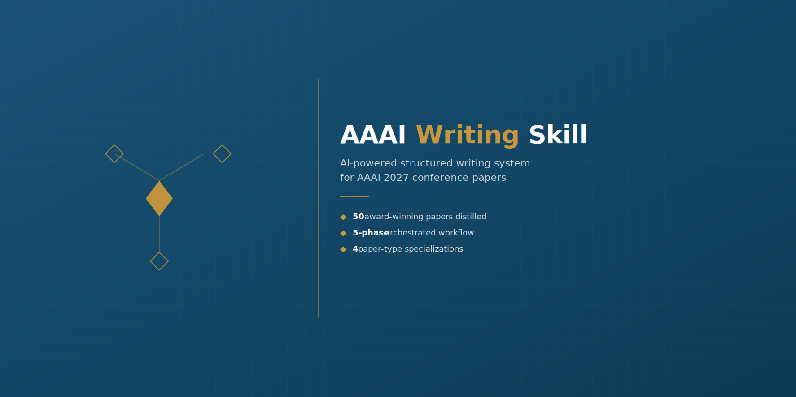
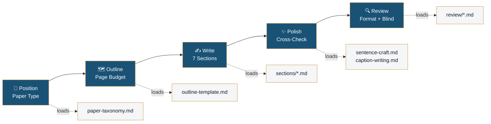

<div align="center">
  
</div>

<div align="center">

[](LICENSE)
[](https://claude.ai/code)
[](https://aaai.org/conference/aaai/aaai-27/)
[](CONTRIBUTING.md)
[](https://github.com/HansonLegacy/aaai-writing/stargazers)

**English** · [**中文**](README_zh.md)

</div>

---

## ✨ What It Does

A **Claude Code Skill** that orchestrates your entire AAAI paper-writing process across 5 phases, with **4 paper-type specializations** and **50 award-winning papers** worth of distilled patterns. Every rule is tagged with its source: `📄` (paper instance) or `📋` (Author Kit spec).

<table>
<tr>
<td width="50%">

✅ **What this is**
- 5-phase orchestrated workflow
- Evidence-based (50-paper corpus)
- 4 paper-type branching
- AAAI 2027 format-aware
- Modular, lazy-loaded prompts

</td>
<td width="50%">

❌ **What this isn't**
- A one-click paper generator
- Writing guidance for CVPR / NeurIPS
- A substitute for research thinking
- A grammar checker

</td>
</tr>
</table>

---

## 🚀 Quick Start

```bash
# Claude Code
git clone https://github.com/HansonLegacy/aaai-writing.git ~/.claude/skills/aaai-writing

# Codex CLI (OpenAI)
git clone https://github.com/HansonLegacy/aaai-writing.git ~/.codex/skills/aaai-writing

# Windows
git clone https://github.com/HansonLegacy/aaai-writing.git %USERPROFILE%\.claude\skills\aaai-writing
```

> 💡 Works with both **Claude Code** and **Codex CLI** — same `SKILL.md` format. The skill auto-activates when you mention AAAI paper writing.

Then just talk to your AI coding agent:

```
You: I'm writing an AAAI 2027 paper about video frame interpolation.
     Help me get started.

Agent: [Phase 1] Let's first identify your paper type...
       [Phase 2] Here's your outline with page budget...
       [Phase 3] Let's write Section 1 — Title...
```

> ⚡ **Prerequisite**: [Claude Code](https://claude.ai/code) or [Codex CLI](https://github.com/openai/codex) installed.

---

## 📖 The Workflow

| # | Phase | What Happens | Output |
|---|-------|-------------|--------|
| 1 | 🧭 **Position** | Identify paper type + core contribution | Type (1–4) + 3 answers |
| 2 | 🗺️ **Outline** | Section plan + page budget + figure plan | Structured outline |
| 3 | ✍️ **Write** | 7 sections in order (lazy-loaded guidance) | LaTeX first draft |
| 4 | ✨ **Polish** | Reverse outlining + claim-evidence mapping + term scan | Coherent manuscript |
| 5 | 🔍 **Review** | Format compliance + double-blind + reproducibility | Submission-ready PDF |



---

## 🎯 Key Features

| | | |
|---|---|---|
| 🏷️ **4 Paper Types** | Theory / Model-Method / Benchmark / Application — each with dedicated templates and structural variants |
| 📊 **50-Paper Corpus** | Quantitative patterns from AAAI 2023–2026 award-winning papers (oral, distinguished, best paper) |
| ✍️ **Sentence Craft** | 34 fill-in-the-blank templates + 15 Before/After rewrite pairs, organized by section |
| 📐 **Caption Writing** | 7 caption templates + 8 Before/After groups — figure and table captions differentiated |
| 🔍 **Review Simulator** | AAAI PC-member view: 7 core questions, 4-round simulation, calibrated scoring |
| 📋 **Format Compliance** | 8-category scan: 25 forbidden packages, 20+ forbidden commands |
| 🚨 **Red Flags** | 65+ reviewer trigger words with regex-ready patterns |
| 🎯 **Triple Alignment** | Pain points ↔ Innovations ↔ Contributions matched in number and order |

---

## 🏗️ Architecture

```mermaid
flowchart TB
    subgraph Orchestration[" "]
        SKILL["SKILL.md<br/>━━━━━━━━━<br/>5-Phase Orchestrator<br/>Zero writing knowledge"]
    end

    subgraph Vertical["sections/ (Vertical)"]
        direction LR
        T["Title"] ~~~ A["Abstract"] ~~~ I["Introduction"] ~~~ R["Related Work"] ~~~ M["Method"] ~~~ E["Experiments"] ~~~ C["Conclusion"]
    end

    subgraph Horizontal["modules/ (Horizontal)"]
        direction LR
        SC["sentence-craft"] ~~~ FD["figure-design"] ~~~ CW["caption-writing"] ~~~ SR["self-review"] ~~~ RV["review/*"]
    end

    subgraph Types["paper-types/"]
        direction LR
        TH["theory"] ~~~ MM["model-method"] ~~~ BR["benchmark"] ~~~ AD["application"]
    end

    SKILL --> Vertical
    SKILL --> Horizontal
    SKILL --> Types

    style Orchestration fill:#1a5276,color:#fff,stroke:#c8963e
    style Vertical fill:#f5f6f8,color:#1a1a2e,stroke:#c8963e
    style Horizontal fill:#f5f6f8,color:#1a1a2e,stroke:#c8963e
    style Types fill:#f5f6f8,color:#1a1a2e,stroke:#c8963e
    style SKILL fill:#1a5276,color:#fff,stroke:#c8963e
    style T fill:#c8963e,color:#1a1a2e,stroke:#c8963e
    style A fill:#c8963e,color:#1a1a2e,stroke:#c8963e
    style I fill:#c8963e,color:#1a1a2e,stroke:#c8963e
    style R fill:#c8963e,color:#1a1a2e,stroke:#c8963e
    style M fill:#c8963e,color:#1a1a2e,stroke:#c8963e
    style E fill:#c8963e,color:#1a1a2e,stroke:#c8963e
    style C fill:#c8963e,color:#1a1a2e,stroke:#c8963e
```



- **`sections/`** — Per-chapter guidance (Abstract → Intro → ... → Conclusion)
- **`modules/`** — Cross-cutting craft (sentences, figures, captions, review)
- **`paper-types/`** — Type injection layer (theory ≠ benchmark ≠ model ≠ application)

> 🧠 **Lazy loading**: only the current phase's module is read — no context bloat.

📖 [Full architecture docs →](docs/architecture.md)

---

## 📚 Documentation

| Document | |
|----------|--|
| [Quick Start](docs/quickstart.md) | Get writing in 5 minutes |
| [Architecture](docs/architecture.md) | Module design + routing + upstream skills |
| [Workflow](docs/workflow.md) | 5 phases with inputs, outputs, and checkpoints |
| [Paper Types](docs/paper-types.md) | 4 types explained with a decision tree |
| [Examples](docs/examples/) | 3 complete walkthroughs (model / theory / benchmark) |
| [FAQ](docs/faq.md) | Language, copyright, other conferences, etc. |

---

## 🔗 Acknowledgments

This skill builds upon excellent open-source work:

| Upstream Project | Author | License | How We Use It |
|-----------------|--------|---------|---------------|
| [Research-Paper-Writing-Skills](https://github.com/Master-cai/Research-Paper-Writing-Skills) | [@Master-cai](https://github.com/Master-cai) | MIT | Core writing methodology (reverse outlining, claim-evidence mapping, section templates) — AAAI-adapted and extended with 50-paper corpus |
| [AI-paper-reviewer](https://github.com/FanBroWell/AI-paper-reviewer) | [@FanBroWell](https://github.com/FanBroWell) | MIT | 10-dimension review framework, format compliance checks, red-flag lexicon — rewritten for AAAI 2027 Author Kit |

> **Note**: Research-Paper-Writing-Skills itself adapts Prof. Peng Sida's [open notes](https://github.com/pengsida/learning_research). We are grateful to both the original author and the curator for making this knowledge openly available.

---

## 🤝 Contributing

We welcome additions — especially from researchers who've been through the AAAI review process.

- 🐛 **Found a broken rule?** [Open a bug report](.github/ISSUE_TEMPLATE/bug_report.md)
- 💡 **Noticed a missing pattern?** [Propose it](.github/ISSUE_TEMPLATE/feature_request.md)
- 📄 **Studied a great AAAI paper?** [Share the instance](.github/ISSUE_TEMPLATE/paper_type_request.md)

See [CONTRIBUTING.md](CONTRIBUTING.md) for full guidelines.

---

## ⭐ Show Your Support

If this skill helped you write a better AAAI paper, **please star this repo** — it helps other researchers find it.

---

## 📝 License

MIT © 2026 HansonLegacy

---

## ⚠️ Disclaimer

**Not affiliated with AAAI.** This tool provides writing guidance based on publicly available Author Kit specifications and published papers. Acceptance depends on the AAAI review process — we help with writing quality, not contribution quality.

* * *

<div align="center">
  <sub>Built with ❤️ for the AI research community</sub>
</div>
