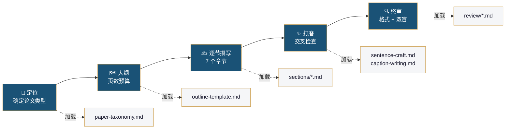

<div align="center">
  
</div>

<div align="center">

[](LICENSE)
[](https://claude.ai/code)
[](https://aaai.org/conference/aaai/aaai-27/)
[](CONTRIBUTING.md)
[](https://github.com/HansonLegacy/aaai-writing/stargazers)

[**English**](README.md) · **中文**

</div>

---

## ✨ 它能做什么

一个**Claude Code / Codex CLI Skill**，编排你的 AAAI 论文从大纲到终稿的完整写作流程。

覆盖 **5 个阶段**、**4 种论文类型特化**、提炼自 **50 篇 AAAI 获奖论文**。每条规律标注来源：`📄`（论文实例）或 `📋`（Author Kit 规范）。

<table>
<tr>
<td width="50%">

✅ **这是什么**
- 5 阶段编排式写作系统
- 基于 50 篇获奖论文的证据驱动
- 4 种论文类型差异化指导
- AAAI 2027 格式感知
- 模块化、按需加载

</td>
<td width="50%">

❌ **这不是什么**
- 一键论文生成器
- CVPR / NeurIPS 写作指导
- 研究思路的替代品
- 语法检查器

</td>
</tr>
</table>

---

## 🚀 快速开始

```bash
# Claude Code
git clone https://github.com/HansonLegacy/aaai-writing.git ~/.claude/skills/aaai-writing

# Codex CLI (OpenAI)
git clone https://github.com/HansonLegacy/aaai-writing.git ~/.codex/skills/aaai-writing

# Windows
git clone https://github.com/HansonLegacy/aaai-writing.git %USERPROFILE%\.claude\skills\aaai-writing
```

> 💡 同时支持 **Claude Code** 和 **Codex CLI**——共用同一套 `SKILL.md` 格式。Skill 在你提到 "AAAI 论文" 时自动激活。

然后直接和你的 AI 编程助手对话：

```
你: 我要写一篇 AAAI 2027 论文，方向是视频插帧。帮我规划一下。

Agent: [Phase 1] 先确定你的论文类型...
       [Phase 2] 这是你的大纲和页数预算...
       [Phase 3] 我们先写标题和摘要...
```

> ⚡ **前提条件**：安装 [Claude Code](https://claude.ai/code) 或 [Codex CLI](https://github.com/openai/codex)。

---

## 📖 五阶段工作流

| # | 阶段 | 做什么 | 产出 |
|---|------|--------|------|
| 1 | 🧭 **定位** | 确定论文类型 + 核心贡献形态 | 类型（1-4）+ 3 个关键答案 |
| 2 | 🗺️ **大纲** | 章节规划 + 页数预算 + 图表计划 | 结构化大纲 |
| 3 | ✍️ **逐节撰写** | 按顺序写 7 个章节（按需加载指导） | LaTeX 初稿 |
| 4 | ✨ **打磨** | Reverse outlining + claim-evidence 映射 + 术语扫描 | 连贯终稿 |
| 5 | 🔍 **审校** | 格式合规 + 双盲检查 + 可复现性 | 投稿就绪 PDF |



---

## 🎯 核心特性

| | | |
|---|---|---|
| 🏷️ **4 种论文类型** | 理论型 / 模型方法型 / 基准资源型 / 应用驱动型——各有专属模板和结构变体 |
| 📊 **50 篇论文语料** | AAAI 2023-2026 获奖论文的定量规律（Oral、Distinguished、Best Paper） |
| ✍️ **句子工艺** | 34 个填空式句法模板 + 15 组 Before/After 改写，按章节组织 |
| 📐 **图注写作** | 7 种 caption 模板 + 8 组改写——图注与表注差异化处理 |
| 🔍 **审稿模拟器** | AAAI PC 视角：7 个核心问题、4 轮模拟、校准评分 |
| 📋 **格式合规** | 8 类别专项扫描：25 个禁用包、20+ 个禁用命令 |
| 🚨 **审稿红旗** | 65+ 个审稿人触发词，含正则批量检查 |
| 🎯 **三重对齐** | 痛点 ↔ 创新 ↔ 贡献 数目和顺序一一对应 |

---

## 🏗️ 架构


- **`sections/`** — 逐章写作指导（标题 → 摘要 → …… → 结论）
- **`modules/`** — 横向工艺（句法、图表、图注、审校）
- **`paper-types/`** — 论文类型注入层（理论 ≠ 基准 ≠ 方法 ≠ 应用）

> 🧠 **按需加载**：每次只加载当前阶段的模块——不膨胀上下文。

📖 [完整架构文档 →](docs/architecture.md)

---

## 📚 文档

| 文档 | 内容 |
|------|------|
| [快速上手](docs/quickstart.md) | 5 分钟开始写作 |
| [架构设计](docs/architecture.md) | 模块设计 + 路由 + 上游 Skill |
| [工作流详解](docs/workflow.md) | 5 阶段输入/输出/检查点 |
| [论文类型](docs/paper-types.md) | 4 种类型详解 + 决策树 |
| [使用案例](docs/examples/) | 3 个完整 walkthrough（模型/理论/基准） |
| [常见问题](docs/faq.md) | 语言、版权、其他会议等 |

---

## 🔗 致谢

本 Skill 基于以下优秀的开源工作：

| 上游项目 | 作者 | 许可证 | 我们的使用方式 |
|---------|------|--------|--------------|
| [Research-Paper-Writing-Skills](https://github.com/Master-cai/Research-Paper-Writing-Skills) | [@Master-cai](https://github.com/Master-cai) | MIT | 核心写作方法论（reverse outlining、claim-evidence 映射、章节模板）——经 AAAI 适配并基于 50 篇语料扩展 |
| [AI-paper-reviewer](https://github.com/FanBroWell/AI-paper-reviewer) | [@FanBroWell](https://github.com/FanBroWell) | MIT | 10 维度审稿框架、格式合规检查、审稿红旗词库——针对 AAAI 2027 Author Kit 重写 |

> **注**：Research-Paper-Writing-Skills 本身源自彭思达教授的[公开笔记](https://github.com/pengsida/learning_research)。我们同时感谢原始作者和整理者的开源贡献。

---

## 🤝 贡献

欢迎贡献——尤其是走过 AAAI 审稿流程的研究者。

- 🐛 **发现了写作规律的错误？** [提 Bug Report](.github/ISSUE_TEMPLATE/bug_report.md)
- 💡 **注意到了缺失的规律？** [提议新 Feature](.github/ISSUE_TEMPLATE/feature_request.md)
- 📄 **读到一篇好的 AAAI 论文？** [分享论文实例](.github/ISSUE_TEMPLATE/paper_type_request.md)

详见 [CONTRIBUTING.md](CONTRIBUTING.md)。

---

## ⭐ 支持项目

如果这个 Skill 帮助你写出更好的 AAAI 论文，**请给项目一个 Star**——让更多研究者发现它。

---

## 📝 许可证

MIT © 2026 HansonLegacy

---

## ⚠️ 免责声明

**与 AAAI 无隶属关系。** 本工具基于公开的 Author Kit 规范和已发表论文提供写作指导。论文接受与否取决于 AAAI 审稿流程——我们帮助提升写作质量，而非贡献质量。

* * *

<div align="center">
  <sub>为 AI 研究社区而建 ❤️</sub>
</div>
